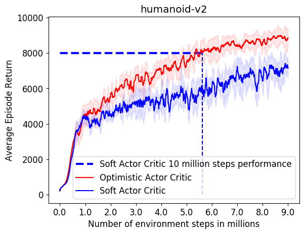

# Optimistic Actor Critic

This repository contains the code accompanying the NeurIPS 2019 paper 'Better Exploration with Optimistic Actor Critic'.

# Reproducing Results

The bash script ```reproduce.sh``` will run Soft Actor Critic and Optimistic Actor Critic on the environment ```Humanoid-v2```, each with 5 seeds. It is recommended you execute this script on a machine with sufficient resources.

After the script finishes, to plot the learning curve, you can run

```
python -m plotting.plot_against_baseline
```

which should produce the following graph



Note that the result in the paper was produced by modifying the Tensorflow code as provided in the [softlearning](https://github.com/rail-berkeley/softlearning) repo.

# Running Experiments

For software dependencies, please have a look inside the ```environment``` folder, you can either build the Dockerfile, create a conda environment with ```environment.yml``` or pip environment with ```environments.txt```.

To create the conda environment, ```cd``` into the ```environment``` folder and run:

```
python install_mujoco.py
conda env create -f environment.yml
```

To run Soft Actor Critic on Humanoid with seed ```0``` as a baseline to compare against Optimistic Actor Critic, run

```
python main.py --seed=0 --domain=humanoid
```

To run Optimistic Actor Critic on Humanoid with seed ```0```,

```
python main.py --seed=0 --domain=humanoid --beta_UB=4.66 --delta=23.53
```

# Hyper-parameter Selection

Note that we are able to remove an hyperparameter relative to the code used for the paper (the k_LB hyper-parameter). The result in the graph above was obtained without using the hyper-parameter k_LB.

# Acknowledgement

This reposity was based on [rlkit](https://github.com/vitchyr/rlkit).

# Citation

If you use the codebase, please cite the paper:

```
@misc{oac,
    title={Better Exploration with Optimistic Actor-Critic},
    author={Kamil Ciosek and Quan Vuong and Robert Loftin and Katja Hofmann},
    year={2019},
    eprint={1910.12807},
    archivePrefix={arXiv},
    primaryClass={stat.ML}
}
```

# Contributing

This project welcomes contributions and suggestions.  Most contributions require you to agree to a
Contributor License Agreement (CLA) declaring that you have the right to, and actually do, grant us
the rights to use your contribution. For details, visit https://cla.opensource.microsoft.com.

When you submit a pull request, a CLA bot will automatically determine whether you need to provide
a CLA and decorate the PR appropriately (e.g., status check, comment). Simply follow the instructions
provided by the bot. You will only need to do this once across all repos using our CLA.

This project has adopted the [Microsoft Open Source Code of Conduct](https://opensource.microsoft.com/codeofconduct/).
For more information see the [Code of Conduct FAQ](https://opensource.microsoft.com/codeofconduct/faq/) or
contact [opencode@microsoft.com](mailto:opencode@microsoft.com) with any additional questions or comments.
